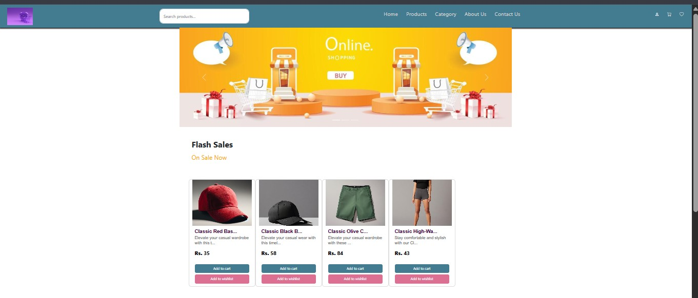
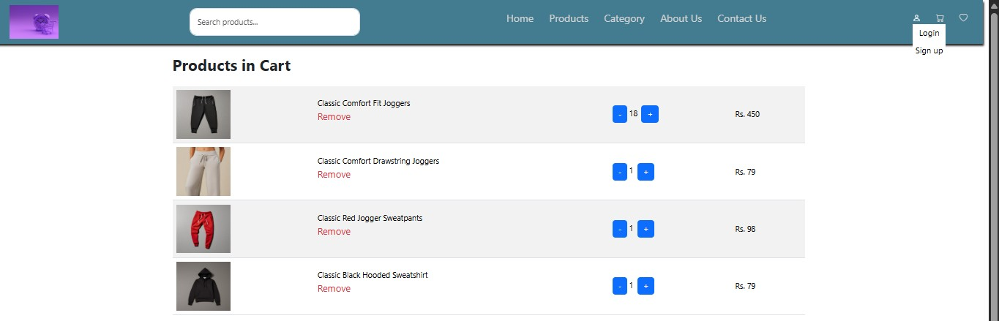
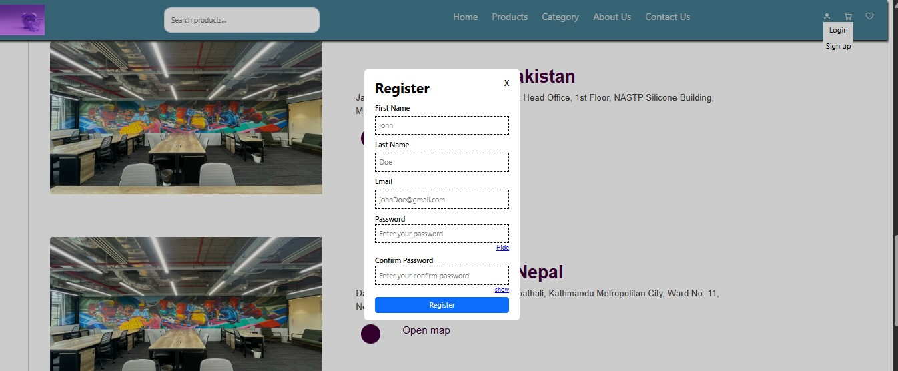
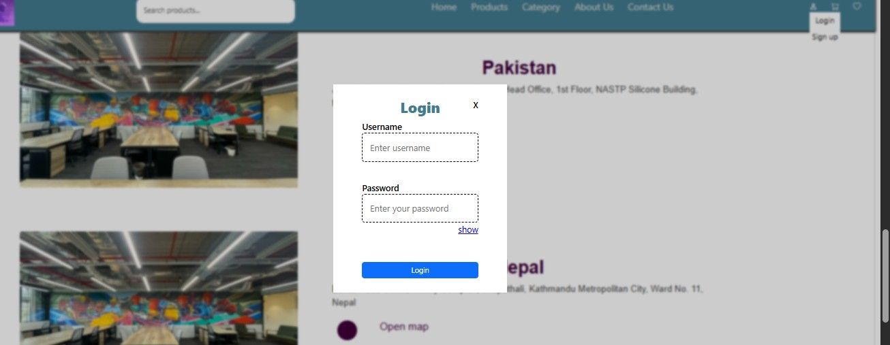

# Timeless Collection 🛍️

A frontend e-commerce web application built with **React 19** and **Vite**, featuring client-side routing, form handling with validation, and toast notifications for a smooth shopping experience.

---

## 🖥️ Live Demo

👉 [timeless-collection-9dkf-md1dvzav0-sabina7.vercel.app](https://timeless-collection-1cc5080id-sabina7.vercel.app/)

## Screenshots

### Homepage



### cart_page



### Register



### Login



## ✨ Features

- 🛒 Product browsing with a clean, responsive UI (Bootstrap 5)
- 📄 Multi-page navigation via React Router
- 📝 Forms with schema-based validation (React Hook Form + Yup) — e.g. login/signup, checkout
- 🔔 Toast notifications for user feedback (React Toastify)
- ⚡ Fast dev/build experience powered by Vite and the React Compiler

## 🛠️ Tech Stack

| Category         | Technology                                |
| ---------------- | ----------------------------------------- |
| Framework        | React 19                                  |
| Build Tool       | Vite                                      |
| Routing          | React Router DOM                          |
| Forms/Validation | React Hook Form, Yup, @hookform/resolvers |
| Styling          | Bootstrap 5                               |
| Notifications    | React Toastify                            |
| Linting          | ESLint (with React Hooks/Refresh plugins) |

## 📦 Running Locally

Check out the [live demo](https://timeless-collection-9dkf-md1dvzav0-sabina7.vercel.app) above to see the project in action. If you'd like to run it locally instead:

```bash
git clone https://github.com/sabina701/Timeless_Collection.git
cd Timeless_Collection
npm install
npm run dev
```

## 📁 Project Structure

```
Timeless_Collection/
├── public/          # Static assets
├── src/             # Application source code
│   ├── components/  # Reusable UI components
│   ├── pages/        # Route-level pages
│   └── ...
├── index.html
├── vite.config.js
└── package.json
```

## 🚀 Roadmap / Future Improvements

- [ ] Connect to a backend/API for real product & order data
- [ ] Add user authentication persistence
- [ ] Add automated tests

## 👤 Author

**Sabina** — [GitHub Profile](https://github.com/sabina701)

---
